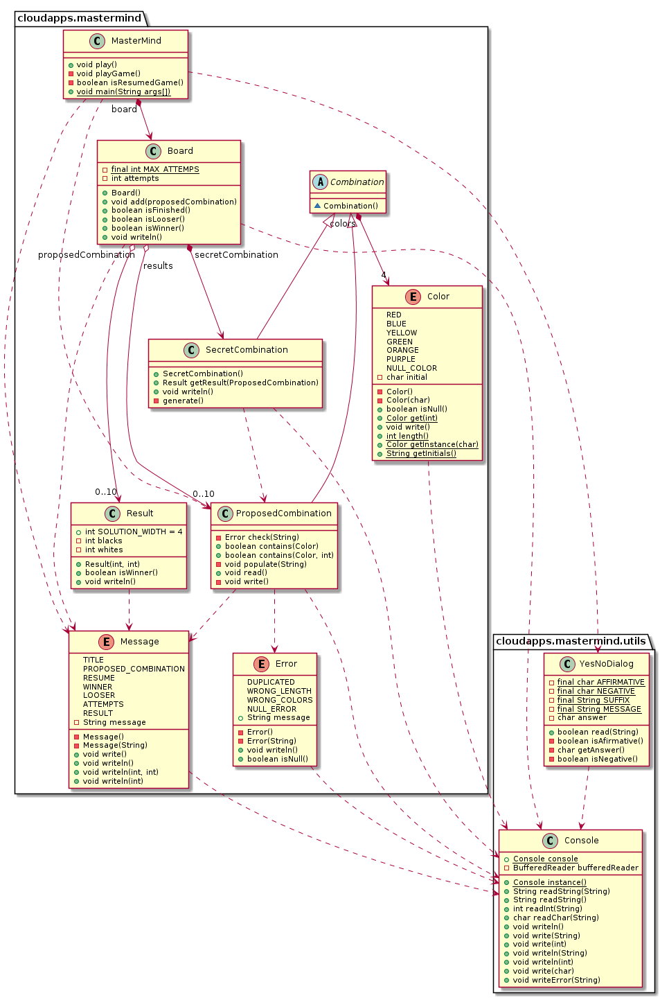

# MasterMind - domainModel 

### 1. Requirements

- [Rules](https://en.wikipedia.org/wiki/Mastermind_(board_game))
- [Video](https://www.youtube.com/watch?v=dMHxyulGrEk)
- You play against the computer
- Secret combination doesn't have repeated colors and any position is empty
- Functionality: Basic
- Interface: Text
- Distribution: Standalone
- Persistence: No

### 2. Domain Model

[diagram source code](img/plantuml/domainModel.plantuml)

### 3. Class Diagram

[diagram source code](img/plantuml/classDiagram.plantuml)

### 4. Deployment

[diagram source code](img/plantuml/deployment.plantuml)

### Author

[David Rojo(@david-rojo)](https://github.com/david-rojo)
