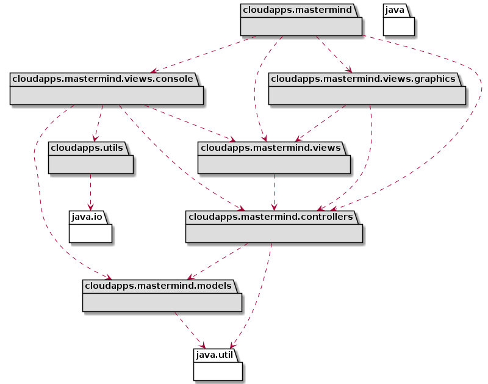
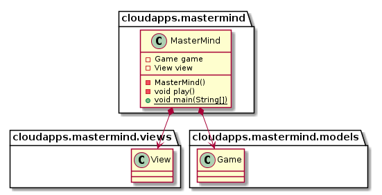
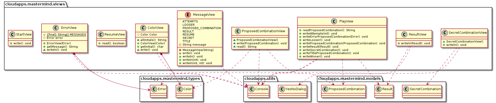
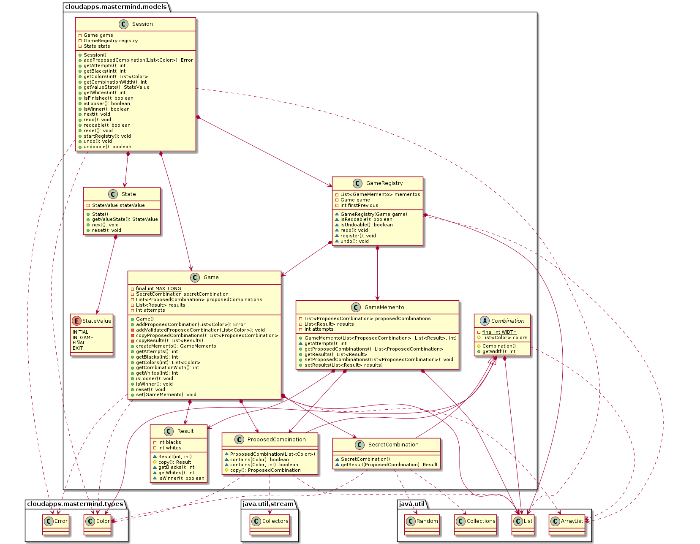
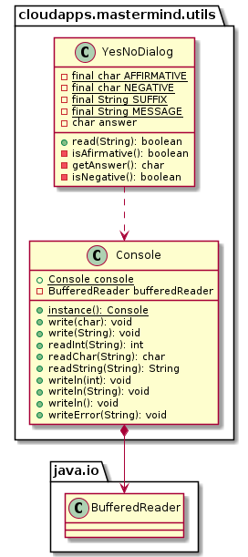

# MasterMind - documentView 

### 1. Requirements

- [Rules](https://en.wikipedia.org/wiki/Mastermind_(board_game))
- [Video](https://www.youtube.com/watch?v=dMHxyulGrEk)
- You play against the computer
- Secret combination doesn't have repeated colors and any position is empty
- Functionality: Basic
- Interface: Text
- Distribution: Standalone
- Persistence: No

### 2. Architecture

### 3. *cloudapps.mastermind* package

### 4. *cloudapps.mastermind.views* package

### 5. *cloudapps.mastermind.models* package

### 6. *cloudapps.mastermind.utils* package

### Author

[David Rojo(@david-rojo)](https://github.com/david-rojo)

