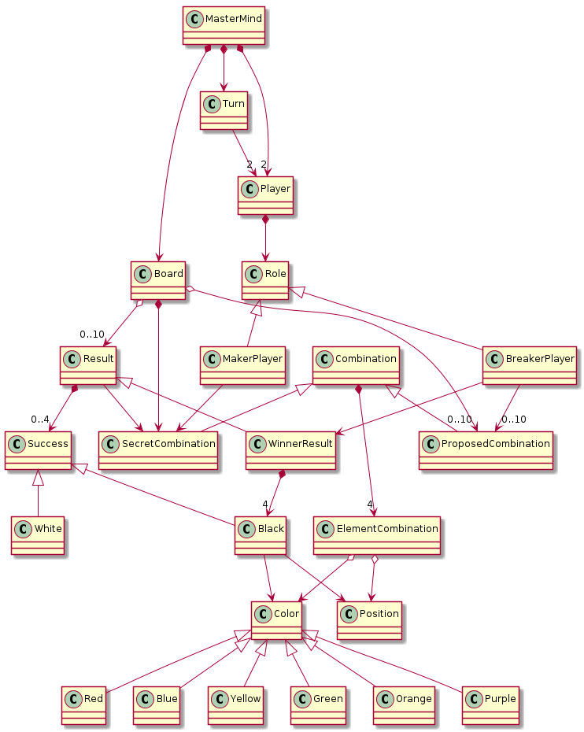
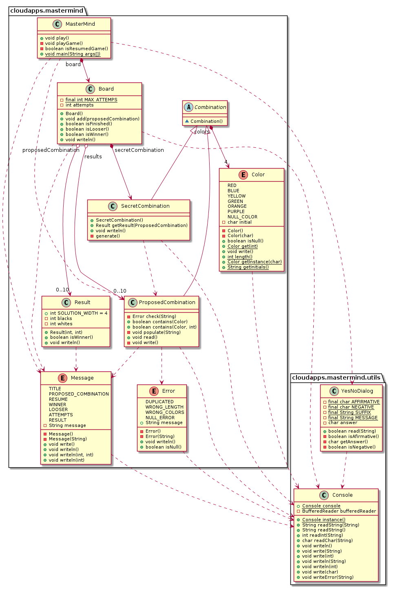

# MasterMind - domainModel 

### 1. Requirements

- [Rules](https://en.wikipedia.org/wiki/Mastermind_(board_game))
- [Video](https://www.youtube.com/watch?v=dMHxyulGrEk)
- Functionality: Basic
- Interface: Text
- Distribution: Standalone
- Persistence: No

### 2. Domain Model

### 3. Class Diagram

### Author

[David Rojo(@david-rojo)](https://github.com/david-rojo)
