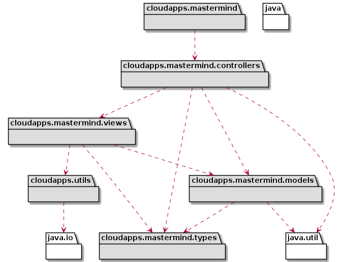
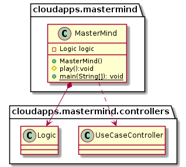
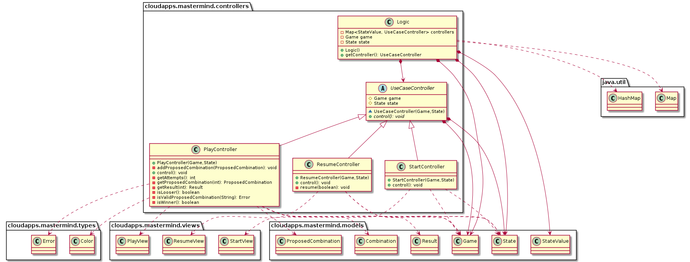

# MasterMind - mvp.pm.withProxy

**PENDING TO BE UPDATED!**

### 1. Requirements

- [Rules](https://en.wikipedia.org/wiki/Mastermind_(board_game))
- [Video](https://www.youtube.com/watch?v=dMHxyulGrEk)
- You play against the computer
- Secret combination doesn't have repeated colors and any position is empty
- Functionality: Basic + undo/redo
- Interface: Text
- Distribution: Standalone
- Persistence: No
- Graphical interface is out of the scope of the project, so it is not described and the available code is not tested that is working

In this branch has been taken in account the application of three design patterns:

- **Command**: for the Menu
- **Composite**: for multi-controllers
- **Memento**: for undo/redo functionality

### 2. Architecture

[diagram source code](img/plantuml/architecture.plantuml)

### 3. Packages

#### 3.1. cloudapps.mastermind package

[diagram source code](img/plantuml/package-cloudapps-mastermind.plantuml)

#### 3.2. cloudapps.mastermind.views package 

[diagram source code](img/plantuml/package-cloudapps-mastermind-views.plantuml)

#### 3.2. cloudapps.mastermind.views.console package

[diagram source code](img/plantuml/package-cloudapps-mastermind-views-console.plantuml)

#### 3.3. cloudapps.mastermind.models package

[diagram source code](img/plantuml/package-cloudapps-mastermind-models.plantuml)

#### 3.4. cloudapps.mastermind.controllers package

[diagram source code](img/plantuml/package-cloudapps-mastermind-controllers.plantuml)

#### 3.5. cloudapps.mastermind.types package

[diagram source code](img/plantuml/package-cloudapps-mastermind-types.plantuml)

#### 3.6. cloudapps.utils package

[diagram source code](img/plantuml/package-cloudapps-utils.plantuml)

### 4. Deployment

[diagram source code](img/plantuml/deployment.plantuml)

### Author

[David Rojo(@david-rojo)](https://github.com/david-rojo)

