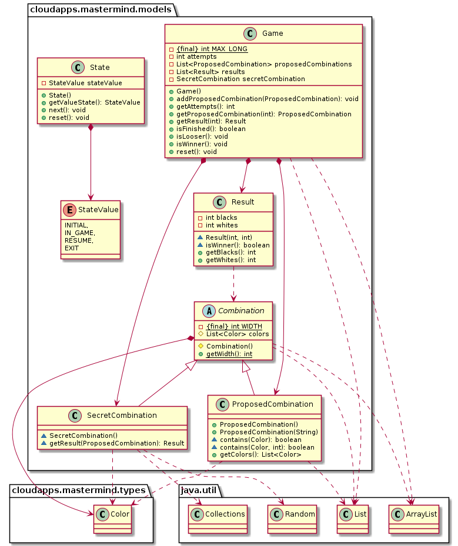

# MasterMind - mvp.pv 

### 1. Requirements

- [Rules](https://en.wikipedia.org/wiki/Mastermind_(board_game))
- [Video](https://www.youtube.com/watch?v=dMHxyulGrEk)
- You play against the computer
- Secret combination doesn't have repeated colors and any position is empty
- Functionality: Basic
- Interface: Text
- Distribution: Standalone
- Persistence: No

### 2. Design

In this branch has been taken in account the change of the control, in the original code ([modelViewPresenter](https://github.com/david-rojo/cloudApps-masterMind/tree/modelViewPresenter) branch applying **mvp.pm.withDoubleDispatching** approach) the Views controlled the Controllers, but here the Controllers have the responsability of the game, now Views are "dummies", only execute methods managed by Controllers to read and write information to the player.

### 3. Architecture

[diagram source code](img/plantuml/architecture.plantuml)

### 4. Packages

#### 4.1. cloudapps.mastermind package

[diagram source code](img/plantuml/package-cloudapps-mastermind.plantuml)

#### 4.2. cloudapps.mastermind.controllers package

[diagram source code](img/plantuml/package-cloudapps-mastermind-controllers.plantuml)

#### 4.3. cloudapps.mastermind.views package

[diagram source code](img/plantuml/package-cloudapps-mastermind-views.plantuml)

#### 4.4. cloudapps.mastermind.models package

[diagram source code](img/plantuml/package-cloudapps-mastermind-models.plantuml)

#### 4.5. cloudapps.mastermind.types package

[diagram source code](img/plantuml/package-cloudapps-mastermind-types.plantuml)

#### 4.6. cloudapps.utils package

[diagram source code](img/plantuml/package-cloudapps-utils.plantuml)

### 5. Deployment

[diagram source code](img/plantuml/deployment.plantuml)

### Author

[David Rojo(@david-rojo)](https://github.com/david-rojo)

