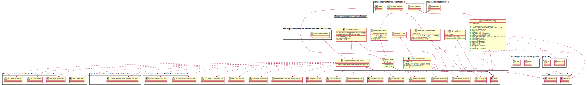

# MasterMind - mvp.pm.withProxy

### 1. Requirements

- [Rules](https://en.wikipedia.org/wiki/Mastermind_(board_game))
- [Video](https://www.youtube.com/watch?v=dMHxyulGrEk)
- You play against the computer
- Secret combination doesn't have repeated colors and any position is empty
- Functionality: Basic + undo/redo
- Interface: Text
- Distribution: Standalone + Client/Sever
- Persistence: No

In this branch has been taken in account the application of **Model/View/Presenter** with **Presenter of the Model** with **Reduced View** (Vista Achicada in Spanish)

- **Proxy** design pattern applied for the distributed execution

### 2. Architecture

[diagram source code](img/plantuml/architecture.plantuml)

### 3. Software quality

#### Design

- **Low Cohesion:** of Logic and Controllers that control and communicate.
- **High Coupling:** of Logic and Controllers to communication tecnologies.
- **Open/Close:** of Logic and Controllers when is needed to change the code of them with new communication tecnologies.

#### Redesign

- **Big Classes:** of Controllers with different branches for different communication tecnologies.

### 4. Packages

#### 4.1. cloudapps.mastermind package

[diagram source code](img/plantuml/package-cloudapps-mastermind.plantuml)

#### 4.2. cloudapps.mastermind.views package 

[diagram source code](img/plantuml/package-cloudapps-mastermind-views.plantuml)

#### 4.3. cloudapps.mastermind.models package

[diagram source code](img/plantuml/package-cloudapps-mastermind-models.plantuml)

#### 4.4. cloudapps.mastermind.controllers package

[diagram source code](img/plantuml/package-cloudapps-mastermind-controllers.plantuml)

#### 4.5. cloudapps.mastermind.controllers.implementation package

[diagram source code](img/plantuml/package-cloudapps-mastermind-controllers-implementation.plantuml)

#### 4.6. cloudapps.mastermind.distributed package

[diagram source code](img/plantuml/package-cloudapps-mastermind-distributed.plantuml)

#### 4.7. cloudapps.mastermind.distributed.dispatchers package

[diagram source code](img/plantuml/package-cloudapps-mastermind-distributed-dispatchers.plantuml)

#### 4.8. cloudapps.mastermind.distributed.dispatchers.errors package

[diagram source code](img/plantuml/package-cloudapps-mastermind-distributed-dispatchers-errors.plantuml)

#### 4.9. cloudapps.mastermind.distributed.dispatchers.undoredo package

[diagram source code](img/plantuml/package-cloudapps-mastermind-distributed-dispatchers-undoredo.plantuml)

#### 4.10. cloudapps.mastermind.types package

[diagram source code](img/plantuml/package-cloudapps-mastermind-types.plantuml)

#### 4.11. cloudapps.utils package

[diagram source code](img/plantuml/package-cloudapps-utils.plantuml)

### 5. Deployment

[diagram source code](img/plantuml/deployment.plantuml)

### Author

[David Rojo(@david-rojo)](https://github.com/david-rojo)

